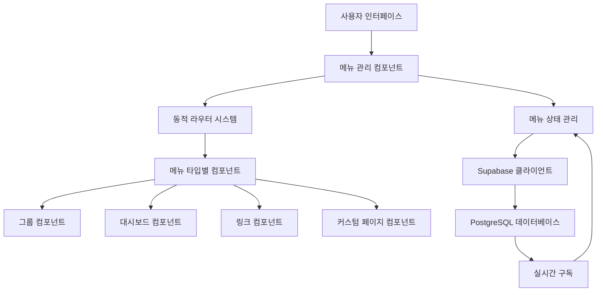

# 디자인 문서

## 개요

커스텀 메뉴 관리 시스템은 사용자가 다양한 타입의 메뉴를 동적으로 생성하고 관리할 수 있는 기능을 제공합니다. 이 시스템은 기존 LOPOOP 애플리케이션의 TanStack Router 기반 아키텍처를 확장하여, 런타임에 메뉴와 라우트를 추가/제거할 수 있도록 설계됩니다. Supabase 실시간 구독을 통해 모든 사용자 세션에서 메뉴 변경사항이 즉시 동기화됩니다.

## 아키텍처

### 전체 시스템 구조



### 핵심 아키텍처 결정사항

1. **컴포넌트 기반 동적 라우팅**: TanStack Router의 정적 라우트 정의 대신, 컴포넌트 레벨에서 동적 라우팅을 구현
2. **메뉴 타입 기반 팩토리 패턴**: 각 메뉴 타입별로 전용 컴포넌트와 기능을 제공하는 팩토리 시스템
3. **실시간 상태 동기화**: Supabase 실시간 구독을 통한 즉시 메뉴 업데이트
4. **계층적 네비게이션**: 기존 메뉴와 커스텀 메뉴의 명확한 구분 및 조직화

## 컴포넌트 및 인터페이스

### 1. 메뉴 관리 컴포넌트

#### MenuManager
```typescript
interface MenuManagerProps {
  userId: string;
}

interface CustomMenu {
  id: string;
  name: string;
  type: MenuType;
  userId: string;
  config: MenuConfig;
  order: number;
  createdAt: string;
  updatedAt: string;
}

enum MenuType {
  GROUP = 'group',
  DASHBOARD = 'dashboard',
  EXTERNAL_LINK = 'external_link',
  CUSTOM_PAGE = 'custom_page',
  PROJECT = 'project'
}
```

#### MenuCreator
```typescript
interface MenuCreatorProps {
  onMenuCreate: (menu: Omit<CustomMenu, 'id' | 'createdAt' | 'updatedAt'>) => void;
  onCancel: () => void;
}

interface MenuFormData {
  name: string;
  type: MenuType;
  config: MenuConfig;
}
```

### 2. 동적 네비게이션 시스템

#### DynamicNavigation
```typescript
interface DynamicNavigationProps {
  customMenus: CustomMenu[];
  onMenuClick: (menuId: string) => void;
}

interface NavigationItem {
  id: string;
  name: string;
  icon: React.ComponentType;
  path: string;
  isCustom: boolean;
}
```

### 3. 메뉴 타입별 컴포넌트

#### MenuTypeFactory
```typescript
interface MenuComponentProps {
  menu: CustomMenu;
  onUpdate: (updates: Partial<CustomMenu>) => void;
}

interface MenuTypeConfig {
  component: React.ComponentType<MenuComponentProps>;
  defaultConfig: MenuConfig;
  icon: React.ComponentType;
  features: string[];
}
```

#### 그룹 메뉴 컴포넌트
```typescript
interface GroupMenuConfig extends MenuConfig {
  members: string[];
  announcements: Announcement[];
  schedules: GroupSchedule[];
}

interface GroupMenuProps extends MenuComponentProps {
  menu: CustomMenu & { config: GroupMenuConfig };
}
```

#### 대시보드 메뉴 컴포넌트
```typescript
interface DashboardMenuConfig extends MenuConfig {
  widgets: Widget[];
  layout: LayoutConfig;
}

interface Widget {
  id: string;
  type: WidgetType;
  position: Position;
  config: WidgetConfig;
}
```

### 4. 실시간 동기화 시스템

#### RealtimeMenuSync
```typescript
interface RealtimeMenuSyncProps {
  userId: string;
  onMenusUpdate: (menus: CustomMenu[]) => void;
}

interface MenuSubscription {
  channel: RealtimeChannel;
  subscription: Subscription;
}
```

## 데이터 모델

### 데이터베이스 스키마

#### custom_menus 테이블
```sql
CREATE TABLE custom_menus (
  id UUID PRIMARY KEY DEFAULT gen_random_uuid(),
  user_id TEXT NOT NULL,
  name TEXT NOT NULL,
  type TEXT NOT NULL CHECK (type IN ('group', 'dashboard', 'external_link', 'custom_page', 'project')),
  config JSONB NOT NULL DEFAULT '{}',
  menu_order INTEGER NOT NULL DEFAULT 0,
  created_at TIMESTAMP WITH TIME ZONE DEFAULT NOW(),
  updated_at TIMESTAMP WITH TIME ZONE DEFAULT NOW(),
  
  CONSTRAINT unique_user_menu_name UNIQUE (user_id, name)
);

-- 인덱스
CREATE INDEX idx_custom_menus_user_id ON custom_menus(user_id);
CREATE INDEX idx_custom_menus_type ON custom_menus(type);
CREATE INDEX idx_custom_menus_order ON custom_menus(user_id, menu_order);

-- RLS 정책
ALTER TABLE custom_menus ENABLE ROW LEVEL SECURITY;

CREATE POLICY "Users can view their own menus" ON custom_menus
  FOR SELECT USING (user_id = current_user);

CREATE POLICY "Users can insert their own menus" ON custom_menus
  FOR INSERT WITH CHECK (user_id = current_user);

CREATE POLICY "Users can update their own menus" ON custom_menus
  FOR UPDATE USING (user_id = current_user);

CREATE POLICY "Users can delete their own menus" ON custom_menus
  FOR DELETE USING (user_id = current_user);
```

#### menu_members 테이블 (그룹 메뉴용)
```sql
CREATE TABLE menu_members (
  id UUID PRIMARY KEY DEFAULT gen_random_uuid(),
  menu_id UUID NOT NULL REFERENCES custom_menus(id) ON DELETE CASCADE,
  user_id TEXT NOT NULL,
  role TEXT NOT NULL DEFAULT 'member' CHECK (role IN ('owner', 'admin', 'member')),
  joined_at TIMESTAMP WITH TIME ZONE DEFAULT NOW(),
  
  CONSTRAINT unique_menu_member UNIQUE (menu_id, user_id)
);

CREATE INDEX idx_menu_members_menu_id ON menu_members(menu_id);
CREATE INDEX idx_menu_members_user_id ON menu_members(user_id);
```

### TypeScript 타입 정의

```typescript
// 기본 메뉴 설정 인터페이스
interface MenuConfig {
  [key: string]: any;
}

// 메뉴 타입별 설정
interface GroupMenuConfig extends MenuConfig {
  description?: string;
  isPrivate: boolean;
  allowMemberInvite: boolean;
  features: {
    announcements: boolean;
    scheduling: boolean;
    fileSharing: boolean;
    chat: boolean;
  };
}

interface DashboardMenuConfig extends MenuConfig {
  layout: 'grid' | 'list' | 'custom';
  widgets: {
    id: string;
    type: 'chart' | 'table' | 'counter' | 'calendar';
    position: { x: number; y: number; w: number; h: number };
    config: Record<string, any>;
  }[];
}

interface ExternalLinkMenuConfig extends MenuConfig {
  links: {
    id: string;
    name: string;
    url: string;
    description?: string;
    icon?: string;
  }[];
  layout: 'grid' | 'list';
}

interface CustomPageMenuConfig extends MenuConfig {
  content: string; // HTML/Markdown 콘텐츠
  allowEdit: boolean;
  template: 'blank' | 'document' | 'wiki';
}

interface ProjectMenuConfig extends MenuConfig {
  description?: string;
  status: 'active' | 'completed' | 'archived';
  features: {
    tasks: boolean;
    timeline: boolean;
    files: boolean;
    discussions: boolean;
  };
}
```

## 정확성 속성

*속성은 시스템이 모든 유효한 실행에서 참이어야 하는 특성이나 동작입니다. 속성은 인간이 읽을 수 있는 명세와 기계 검증 가능한 정확성 보장 사이의 다리 역할을 합니다.*

### 속성 1: 메뉴 타입 선택 시 설정 옵션 표시
*모든* 메뉴 타입에 대해, 해당 타입을 선택하면 관련된 설정 옵션이 표시되어야 합니다
**검증: 요구사항 1.2**

### 속성 2: 메뉴 이름 검증 및 고유성
*모든* 메뉴 이름 입력에 대해, 유효한 텍스트는 허용되고 중복된 이름은 거부되어야 합니다
**검증: 요구사항 1.3, 3.3**

### 속성 3: 메뉴 생성 시 네비게이션 자동 업데이트
*모든* 메뉴 생성에 대해, 네비게이션에 해당 메뉴 항목이 즉시 추가되어야 합니다
**검증: 요구사항 1.4, 7.1**

### 속성 4: 메뉴 생성 시 데이터베이스 지속성
*모든* 메뉴 생성에 대해, 메뉴 데이터가 즉시 데이터베이스에 저장되고 조회 가능해야 합니다
**검증: 요구사항 1.5**

### 속성 5: 메뉴 타입별 자동 페이지 생성
*모든* 커스텀 메뉴에 대해, 선택된 메뉴 타입에 맞는 전용 페이지가 자동 생성되어야 합니다
**검증: 요구사항 2.1**

### 속성 6: 메뉴 클릭 시 올바른 라우팅
*모든* 커스텀 메뉴 항목에 대해, 클릭하면 해당하는 전용 페이지로 정확히 라우팅되어야 합니다
**검증: 요구사항 2.2**

### 속성 7: 메뉴 타입별 적절한 기능 표시
*모든* 자동 생성 페이지에 대해, 메뉴 타입에 맞는 기능과 레이아웃이 표시되어야 합니다
**검증: 요구사항 2.3**

### 속성 8: 페이지 제목 및 데이터 표시
*모든* 메뉴 페이지에 대해, 사용자 정의 메뉴 이름이 제목에 포함되고 현재 메뉴 데이터가 올바르게 로드되어야 합니다
**검증: 요구사항 2.4, 2.5**

### 속성 9: 한국어/영어 텍스트 및 특수문자 지원
*모든* 메뉴 이름 입력에 대해, 유효한 한국어, 영어, 특수문자, 숫자가 허용되어야 합니다
**검증: 요구사항 3.2, 3.4**

### 속성 10: 메뉴 이름 변경 시 실시간 업데이트
*모든* 메뉴 이름 변경에 대해, 네비게이션이 즉시 업데이트되어야 합니다
**검증: 요구사항 3.5**

### 속성 11: 메뉴 타입별 기능 토글
*모든* 메뉴 타입에 대해, 특정 기능을 활성화/비활성화할 수 있고 변경사항이 적용되어야 합니다
**검증: 요구사항 4.5**

### 속성 12: 메뉴 설정 편집 인터페이스
*모든* 메뉴에 대해, 설정에 접근하면 현재 설정이 편집 가능한 형태로 표시되어야 합니다
**검증: 요구사항 5.1**

### 속성 13: 메뉴 변경사항 검증 및 실시간 동기화
*모든* 메뉴 편집에 대해, 변경사항이 검증되고 저장 시 네비게이션과 페이지 콘텐츠가 즉시 업데이트되어야 합니다
**검증: 요구사항 5.2, 5.3**

### 속성 14: 호환 가능한 메뉴 타입 간 데이터 보존
*모든* 호환 가능한 메뉴 타입 변경에 대해, 기존 메뉴 데이터가 보존되어야 합니다
**검증: 요구사항 5.4**

### 속성 15: 메뉴 삭제 시 확인 대화상자 표시
*모든* 메뉴 삭제 요청에 대해, 메뉴 세부사항과 결과를 보여주는 확인 대화상자가 표시되어야 합니다
**검증: 요구사항 6.1**

### 속성 16: 메뉴 삭제 시 완전 제거
*모든* 메뉴 삭제 확인에 대해, 메뉴, 데이터, 네비게이션 항목이 모두 제거되어야 합니다
**검증: 요구사항 6.2**

### 속성 17: 삭제된 메뉴 데이터 복구 기간 보관
*모든* 메뉴 삭제에 대해, 영구 삭제 전 복구 기간 동안 데이터가 보관되어야 합니다
**검증: 요구사항 6.3**

### 속성 18: 공유 메뉴 삭제 시 사용자 알림
*모든* 다른 사용자에게 영향을 주는 메뉴 삭제에 대해, 영향받는 사용자들에게 알림이 전송되어야 합니다
**검증: 요구사항 6.4**

### 속성 19: 메뉴 삭제 실패 시 상태 유지 및 오류 설명
*모든* 메뉴 삭제 실패에 대해, 현재 상태가 유지되고 사용자에게 오류가 설명되어야 합니다
**검증: 요구사항 6.5**

### 속성 20: 커스텀 메뉴 전용 섹션 조직화
*모든* 네비게이션 렌더링에 대해, 커스텀 메뉴가 핵심 기능과 구분된 전용 섹션에 정리되어야 합니다
**검증: 요구사항 7.2**

### 속성 21: 메뉴 접근 권한 변경 시 가시성 업데이트
*모든* 메뉴 접근 권한 변경에 대해, 네비게이션 가시성이 그에 따라 업데이트되어야 합니다
**검증: 요구사항 7.3**

### 속성 22: 메뉴 순서 관리 및 재정렬
*모든* 메뉴 재정렬에 대해, 새로운 순서가 유지되고 올바르게 적용되어야 합니다
**검증: 요구사항 7.4**

### 속성 23: 네비게이션 업데이트 실패 시 복구
*모든* 네비게이션 업데이트 실패에 대해, 동기화 재시도가 이루어지고 캐시된 상태가 유지되어야 합니다
**검증: 요구사항 7.5**

### 속성 24: 사용자당 메뉴 수 제한
*모든* 메뉴 생성 시도에 대해, 사용자당 최대 메뉴 수 제한이 적용되어야 합니다
**검증: 요구사항 8.1**

### 속성 25: 악성 콘텐츠 검증
*모든* 메뉴 이름과 설정 입력에 대해, 악성 콘텐츠가 검증되고 거부되어야 합니다
**검증: 요구사항 8.2**

### 속성 26: 실시간 메뉴 변경사항 동기화
*모든* 메뉴 변경사항에 대해, 모든 사용자 세션에서 실시간 업데이트가 제공되어야 합니다
**검증: 요구사항 8.4**

<function_calls>
<invoke name="prework">
<parameter name="featureName">custom-menu-management

## 오류 처리

### 1. 메뉴 생성 오류
- **중복 이름**: 사용자에게 명확한 오류 메시지와 대안 제안
- **타입 선택 실패**: 기본 타입으로 폴백하고 사용자에게 알림
- **데이터베이스 연결 실패**: 로컬 캐시에 임시 저장 후 재시도

### 2. 네비게이션 동기화 오류
- **실시간 구독 실패**: 폴링 방식으로 폴백
- **라우팅 실패**: 기본 페이지로 리다이렉트
- **메뉴 로드 실패**: 캐시된 메뉴 상태 사용

### 3. 메뉴 타입별 오류
- **그룹 멤버 추가 실패**: 롤백 및 재시도 옵션 제공
- **대시보드 위젯 로드 실패**: 기본 위젯으로 대체
- **외부 링크 접근 실패**: 링크 상태 표시 및 재시도 버튼

### 4. 권한 및 보안 오류
- **권한 부족**: 명확한 권한 요구사항 안내
- **악성 콘텐츠 감지**: 입력 차단 및 보안 경고
- **세션 만료**: 자동 재로그인 프롬프트

## 테스트 전략

### 이중 테스트 접근법
시스템의 정확성을 보장하기 위해 단위 테스트와 속성 기반 테스트를 모두 사용합니다:

- **단위 테스트**: 특정 예제, 엣지 케이스, 오류 조건 검증
- **속성 테스트**: 모든 입력에 대한 범용 속성 검증
- 두 방법은 상호 보완적이며 포괄적인 커버리지를 위해 모두 필요합니다

### 단위 테스트 전략
단위 테스트는 다음에 중점을 둡니다:
- 메뉴 타입별 특정 기능 예제 (그룹, 대시보드, 링크, 커스텀 페이지)
- 컴포넌트 간 통합 지점
- 엣지 케이스 및 오류 조건
- 사용자 인터페이스 상호작용

### 속성 기반 테스트 전략
속성 테스트는 다음에 중점을 둡니다:
- 랜덤화를 통한 포괄적인 입력 커버리지
- 설계 문서의 범용 속성 검증
- 각 속성 테스트는 최소 100회 반복 실행
- 각 테스트는 해당하는 설계 속성을 참조

### 속성 기반 테스트 라이브러리
- **JavaScript/TypeScript**: fast-check 라이브러리 사용
- 각 정확성 속성은 단일 속성 기반 테스트로 구현
- 테스트 태그 형식: **Feature: custom-menu-management, Property {번호}: {속성 텍스트}**

### 테스트 커버리지 영역

#### 1. 메뉴 생성 및 관리
- 메뉴 타입 선택 및 설정 옵션 표시
- 메뉴 이름 검증 (고유성, 문자 지원)
- 데이터베이스 지속성 및 실시간 동기화

#### 2. 동적 네비게이션
- 메뉴 항목 자동 추가/제거
- 네비게이션 섹션 조직화
- 권한 기반 가시성 제어

#### 3. 메뉴 타입별 기능
- 그룹: 멤버 관리, 공지사항, 스케줄링
- 대시보드: 위젯 관리, 레이아웃 커스터마이징
- 외부 링크: 링크 관리, 빠른 접근
- 커스텀 페이지: 콘텐츠 에디터, 템플릿

#### 4. 실시간 동기화
- Supabase 실시간 구독
- 다중 세션 간 메뉴 변경사항 동기화
- 연결 실패 시 폴백 메커니즘

#### 5. 오류 처리 및 복구
- 네트워크 오류 시 재시도 로직
- 데이터 손실 방지 메커니즘
- 사용자 친화적 오류 메시지

### 테스트 환경 설정
- **개발 환경**: 로컬 Supabase 인스턴스 사용
- **CI/CD**: GitHub Actions에서 자동화된 테스트 실행
- **통합 테스트**: 실제 데이터베이스와 실시간 구독 테스트
- **성능 테스트**: 대량 메뉴 처리 시나리오

### 테스트 데이터 관리
- **테스트 격리**: 각 테스트는 독립적인 데이터 세트 사용
- **정리 작업**: 테스트 완료 후 자동 데이터 정리
- **시드 데이터**: 일관된 테스트 환경을 위한 기본 데이터 세트